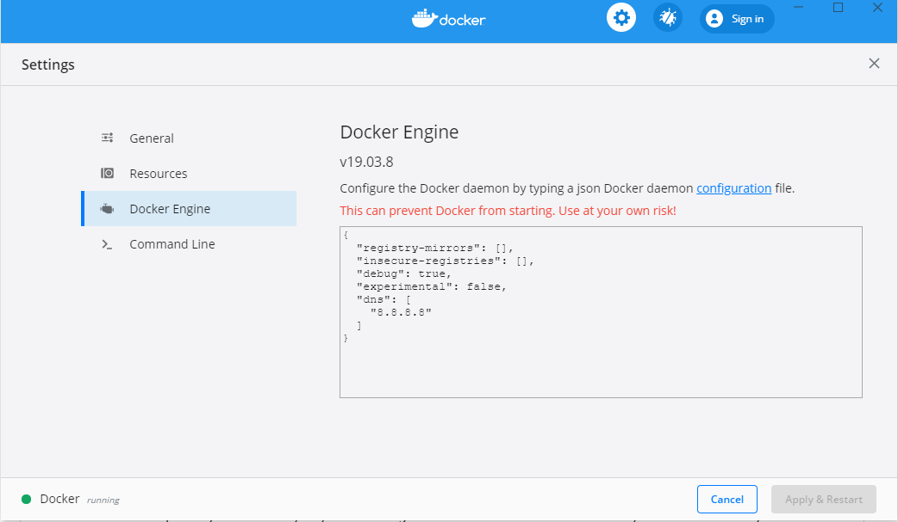

# Thread for Sitecore

## Overview

Thread is a tool kit of parts to accelerate Sitecore builds.

## Version
v7.2.1
See [Thread Release Notes](https://velirs.atlassian.net/wiki/spaces/VR/pages/140544650/Release+Notes).

## Prerequisites

* Visual Studio 2019+
* .NET Framework 4.8
* Docker Desktop

## Installation

Before getting started, it is recommended you read through the Back-end and Front-end Implementation Guides: <https://velirs.atlassian.net/wiki/spaces/VR/pages/137894237/Implementation+Guide>

### Starting a New Client Project with Thread

The instructions below go over installing and working with Thread Proper.  If you looking at setting a new client project based on Thread, please refer to the **Cloning the Thread-Sitecore GitHub Repository** section of the [Back-end Implemenation Guide](https://velirs.atlassian.net/wiki/spaces/VR/pages/137894237/Implementation+Guide), before proceeding.

### Docker Configuration Prerequisites

1. The `Containers` feature enabled in Windows. It can be enabled executing the following command in PowerShell as Administrator:
    -   `Enable-WindowsOptionalFeature -Online -FeatureName containers –All`

2. [Docker Desktop](https://download.docker.com/win/stable/Docker%20Desktop%20Installer.exe) installed and configured with the following settings:
    - Switch to Windows container, right-clicking on the Docker Desktop icon in the hidden system icons in the taskbar and selecting `Switch to Windows containers...`.
    - Add a "dns" property in the Docker engine deamon: `"dns": ["8.8.8.8"]`, right-clicking on the Docker Desktop icon in the hidden system icons in the taskbar and selecting `Settings`.

      
    - Change "experimental" property to `true`.
    
    - Under Docker Desktop General Settings:
      - Ensure "Use the WSL 2 based engine" is checked.
      - Ensure "Use Docker Compose V2" is unchecked.

3. Hyper-V feature enabled (including Hyper-V hypervisor)
    - NOTE: Docker and VirtualBox cannot run successfully on a Windows host machine at the same time. This conflict can be resolved disabling Hyper-V hypervisor (if you want to run VirtualBox) or enabling it (if you want to run Docker, with the following commands to execute in a Command Prompt window as administrator (a machine restart is required after executing this command):
        - Disable command: `bcdedit /set hypervisorlaunchtype off`
        - Enable command: `bcdedit /set hypervisorlaunchtype auto`

### Local Environment Setup

1. Ensure you have completed all prerequisites.
2. Clone this repository to a directory of your choosing.  This location will be referred to as your **source** directory.
3. Open a Powershell window as Administrator in the root of your **source** directory
4. In your Powershell console, run `.\up.ps1`.  (If this your first time running the script, you will be prompted for a path to your Sitecore license file, enter a valid path (e.g. C:\data\license\license.xml) and press 'Enter')

### Creating a New Site

1. From the Sitecore Content Editor, right-click the **Content** item and create a new site using the branch: `/sitecore/templates/Branches/Thread/Project/Graybox/Sites/New Site`.
2. Update `rootPath` attribute of website site, in the `/src/Project/Graybox/code/App_Config/Include/zThread/Thread.Project.Graybox.config.example` and rename the file to `Thread.Project.Graybox.config`.
3. Right-click `Thread.Project.Graybox.config`, select **Properties** and set `Build Action` to `Content`.
4. Right-click on Thread.Project.Graybox, click **Publish...**.

### Installing Horizion

Horizon customizes the functionality to add fields to Solr, and this customization conflicts with Thread. This is only an issue during installation, when running "Populate Solr Schema" for the "sitecore_horizon_index". The Horizon class is "internal", so cannot be extended. The workaround is to comment out this line in Foundation.Search.config during the Horizon installation, and then uncomment it afterwards.

    <param set:type="Thread.Foundation.Search.Schema.CustomPopulateHelperFactory,Thread.Foundation.Search" />

### Powershell Module: Kneedle

Added to the solution is a Powershell module called "Kneedle". Kneedle replaces the Helix-based Gulp tasks from previous Thread versions and provides other helpers for managing your development environment.  To see an up-to-date list of available commands, first ensure your version of the module is up-to-date by running: `Import-Module .\tools\powershell\Kneedle\Kneedle.psm1 -Force`.  Then run, `Get-Command -Module Kneedle`. To see more information about a particular command, use the Powershell `Get-Help` function.  For example: `Get-Help Sync-Unicorn`.  Double-clicking the `start-knitting.bat` in the root of the directory will automatically start a Powershell console in Administrator mode with the Kneedle Powershell module already imported.