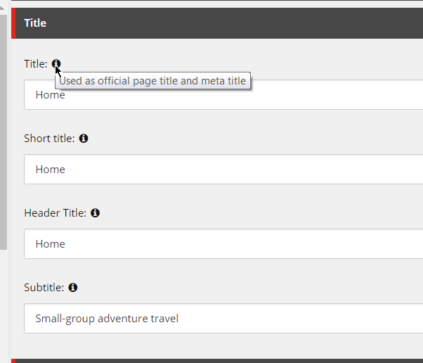
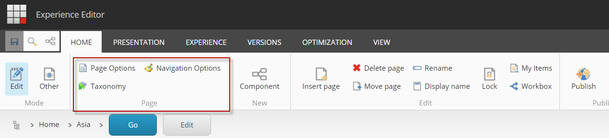
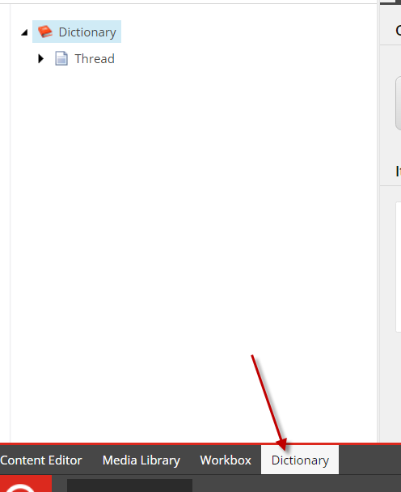

# AX (Authoring Experience) - Foundation Module

## Overview

This module is a collection of small enhancements to the Content Author's experience.

## Features

### Field Tooltips

When the Long Description field for a Template's field is filled out, the help text is usually displayed next to the field name.  Since this description can be verbose (hence "Long Description"), we've injected some css to replace the Long Description text with an icon and place the text as a tooltip on the field name.

**Related Files**

* `./code/App_Config/Include/zThread/Thread.Foundation.Ax.config`
* `./code/Pipelines/RenderContentEditor/InjectContentEditorResources.cs`
* `./code/Areas/Thread/css/tooltip.css`
* `./code/Areas/Thread/js/tooltip.js`

### Custom Experience Editor Ribbon Buttons

Custom ribbon buttons that appear on the Home tab of the Experience Editor Ribbon.  When clicked, a modal pops up that allows editing of fields that appear on the current item/page.  This are useful for all the content author to edit useful, page-level fields that may not be visible/editable in any other component that appears on the page (e.g. Taxonomy fields like Topics or Tags).

**Related Files**

* `./code/Areas/Thread/Scripts/LaunchFieldEditor.js`
* `./code/SpeakRequests/FieldEditorItemContext.cs`
* `./code/SpeakRequests/GenerateFieldEditorURls.cs`
* All items under `/sitecore/Applications/WebEdit/Ribbons/WebEdit/Page Editor` in the Thread.Foundation.AX.Core TDS project.

### Insert Newly Created Items Last

This functionality uses an Item:Created event handler to ensure that a newly created item is inserted as the last item in the list.  This functionality was added for components like Multi Promo Container and Multi Image Container where child items (Promos and Images, respectively) can be created via the container component in Experience Editor.  Whithout this handler, the items would be inserted in alphabetical order which may appear random when editing in Experience Editor mode.

**Related Files**

* `./code/App_Config/Include/zThread/Thread.Foundation.Ax.config`
* `./code/Events/ItemCreated/InsertItemLastEventHandler.cs`

### Custom Experience Editor CSS

The code in this project allows for injecting resources like css and javascript into the page when in Preview and Experience Editor mode.  The files to include are managed via configuration.  You can see an example of how to do this in the `Thread.Foundation.AX.config`.  Another module makes use of this functionality to insert custom CSS to style components differently when in Experience Editor mode or fix inconsistencies due to the extra HTML Sitecore injects in Experience Editor mode.

**Related Files**

* `./code/App_Config/Include/zThread/Thread.Foundation.Ax.config`
* `./code/Pipelines/RenderPageExtenders/InjectPageEditorResources.cs`

### Rebuild Dictionary on Application Start

Sitecore's dictionary gets built and stored as a temporary file on disk.  For various reasons, we seem to continually encounter issues where the dictionary does not get properly updated or becomes out of sync.  In order, to try and ensure the dictionary is properly generated, we've added some code to rebuild the dictionary on Application Start.

**Related Files**

* `./code/App_Config/Include/zThread/Thread.Foundation.Ax.config`
* `./code/Pipelines/Initialize/InitializeDictionary.cs`

### Dictionary Shortcut

Since the dictionary is found in the System area of Sitecore, content authors might not know where to find the Dictionary or be afraid to venture into area called "System".  A simple change we made was to make this more accessible in Content Editor by adding a more prominent link that targets the Dictionary section, specifically, in the Content Editor tree.

**Related Files**

* The item `/sitecore/Applications/Content Editor/Applications/Dictionary` in the Thread.Foundation.AX.Core TDS project.