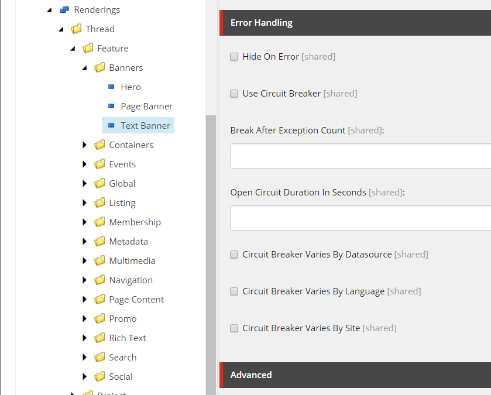

# ErrorHanding - Foundation Module

## Overview

This module contains functionality to select which page should act as the 404 Error Page for the site.  It also integrates Jabberwocky's Polly module.  This package integrates the Polly circuit breaker pattern directly into Sitecore with options provided directly on the Renderings in Sitecore.

## Features

### 404 Error Page Configuration

The *Error Handing Configuration* template (which is inherited by the *Site Configuration Folder* template) contains a single droptree field named, *404 Page Location*.  If a URL is requested where the corresponding Sitecore item cannot be found, or does not have a layout set, the page selected in the *404 Page Location* field will be used instead.

This functionality is implemented by overriding Sitecore's `ExecuteRequest` processor in the `httpRequestBegin` pipeline.  This method allows us to successfully set the 404 Status Code in the response.

### Rendering Errors

In an effort to more gracefully handle errors within individual components, we've overridden the `ExecuteRenderer` processor in the `mvc.renderRendering` pipeline.  When trying to render a component, if an error is caught, the component will be hidden.  When in Experience Editor or Preview mode, the error will be caught and replaced by a message stating there was an error with the component and display the error encountered.  This will allow content authors and testers to see there is an issue and what the issue is, without completely disrupting the display of the page.

### Jabberwocky.Extras.Polly.Sc

This package adds an *Error Handling* section to the standard Rendering template, which provides some fairly straightforward controls to enable and manage the [circuit breaker pattern](https://martinfowler.com/bliki/CircuitBreaker.html) for a given rendering.

