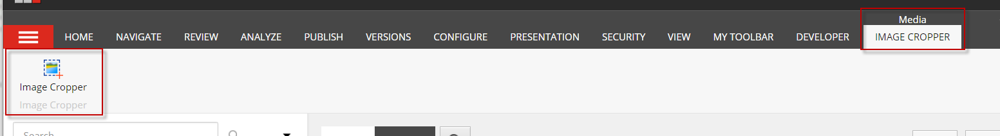
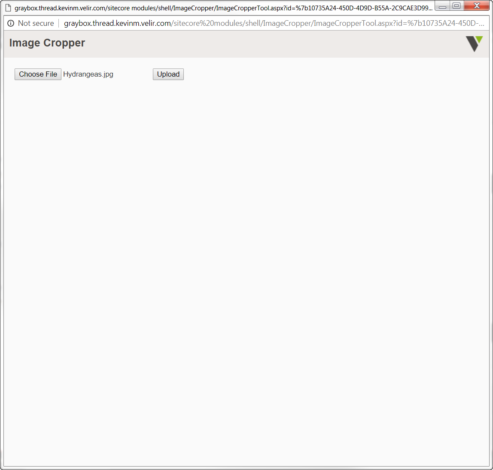
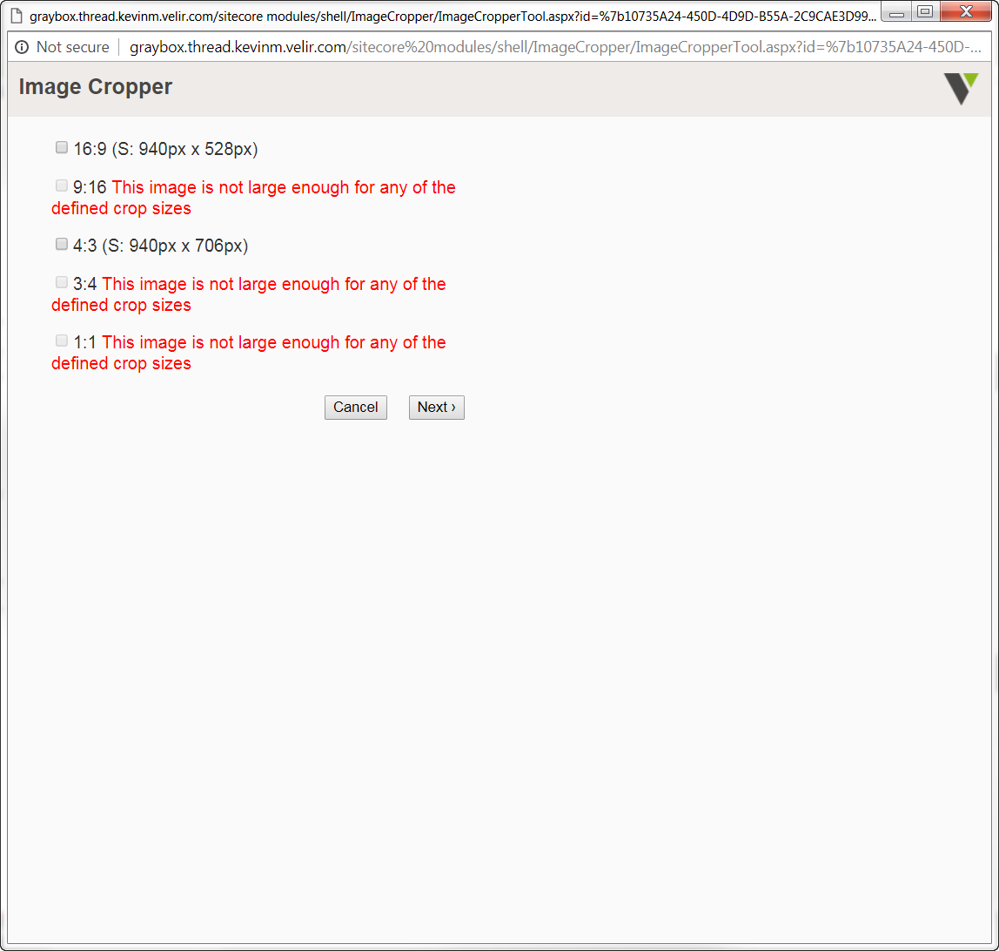
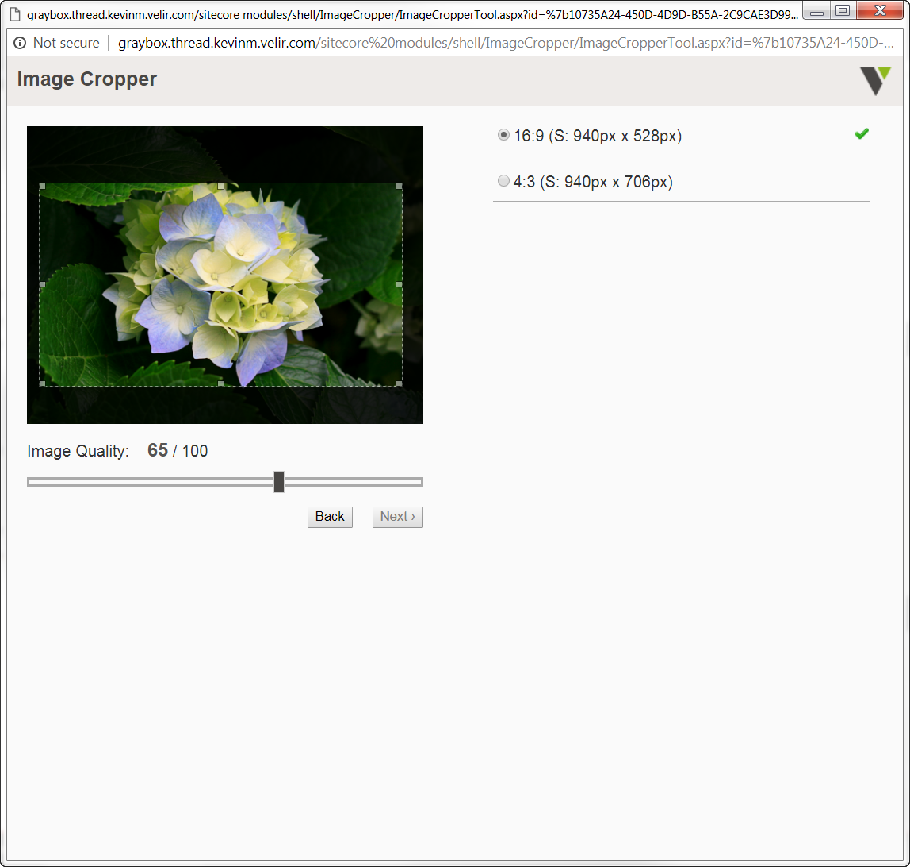
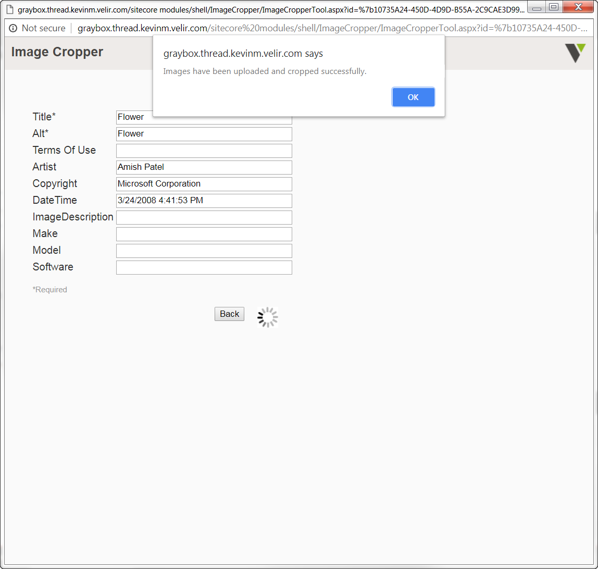
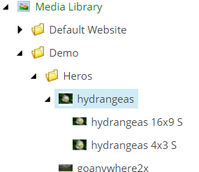

# ResponsiveImages - Foundation Module

## Overview

This module provides enhancements to images.  It includes the integration of Velir's Image Cropper utility and some functionality to support the display of retina images across the site.

## Features

### Image Cropper

The image cropper is a tool that allows administrators to define specific aspect ratios for images in Sitecore and allow content authors to crop uploaded images by these dimensions.

The Image Cropper can be opened from a Media Folder or Jpeg item in the Media Library.  When in Content Editor, you'll see the Image Cropper Contextual Ribbon.  Clicking the Image Cropper button will open the modal.



When opened from a Media Folder, the modal will give an option to upload a photo:



Otherwise, you can select the available aspect ratios you would like to crop your image for.  These Dimensions are defined in the `/sitecore/system/modules/Image Cropper` folder.



Once the crop types are selected, you can define the focus, size and image quality of each crop.  The viewfinder will restrict the user to the aspect ratio and minimum image size defined in Sitecore:



After all crops are defined, you must fill out the Alt text and can view any metadata defined in the image.  Then you can save your crops or save and publish.


If successful, you will be presented with an alert window.  



Crops are saved as child items of the originally uploaded image.  This allows the user to re-crop, if necessary.



#### Retina Images

The `ResponsiveGlassView` extends the functionality of Glass.Mapper's `GlassView` to add retina image support to valid images.  If an image width is specified, and the sourced image is at least 2x of the requested width, the `srcset` attribute will be added to the `` tag.  This functionality is built into the `RenderImage` and `Editable` functions of `ResponsiveGlassView`. Below is an example of using the `ResponsiveGlassView` in a Razor View:

```
@inherits AtriusHealth.Foundation.ResponsiveImages.Mvc.ResponsiveGlassView<My.GlassModel.IImage>

@RenderImage(model => model.Image, new { mw = 500 }, true)
```

As long as the image in Sitecore is at least 1000px wide the resulting image tag will look something like:

```

```
